# MikroTik-GRE-over-IPsec-Lab

## OverView
This Project demonstrates how to create a secure Site-to-Site VPN using a GRE Tunnel protected by IPsec between two MikroTik routers.
the GRE Tunnel provides Layer 3 connectivity between two remote LANs, to ensure confidentiality and security.

## Objectives
- Confiure GRE Tunnel

- Protect GRE using IPsec

- Configure IP addressing

- Configure Static Routing

- Verify end-to-end connectivity

- Test secure communication between two LANs

## Network Topology

## IP Addressing
### MikroTik 1
- ether1: 192.168.1.1/24 --> LAN 

- ether2: 172.16.1.1/16 --> WAN

- GRE Tunnel: 10.10.10.1/30 --> Tunnel

### MikroTik 2
- ether1: 192.168.2.2/24 --> LAN

- ether2: 172.16.2.2/16 --> WAN

- GRE Tunnel: 10.10.10.2/30 --> Tunnel

## Configuration Steps
### 1. Configure GRE Tunnel
configure a GRE Tunnel on both MikroTik routers.

- Local Address

- Remote Address

- IPsec Secret

- allow-fast-port=no
  
### 2. Assign Tunnel IP Address
  MikroTik 1: ip address add address=10.10.10.1/30 interface=gre-to-site

  MikroTik2: ip address add address=10.10.10.2/30 interface=gre-to-site

### 3.Configure Static Routes
  MikroTik1: ip route add dst-address=192.168.2.0/24 gateway=10.10.10.2

  MikroTik2: ip route add dst-address=192.168.1.0/24 gateway=10.10.10.1

  
## Connectivity Test

ping GRE Tunnel IP (MikroTik1 --> 10.10.10.2):

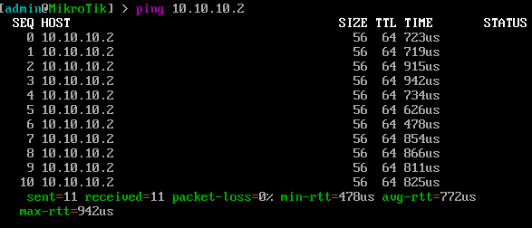

ping GRE Tunnel IP (MikroTik2 --> 10.10.10.1):

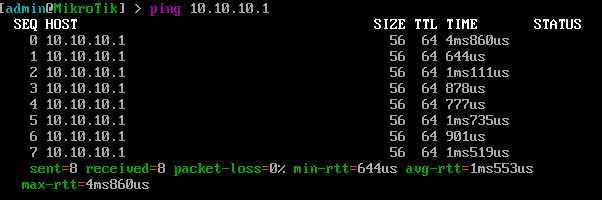

ping remote lan from MikroTik1:

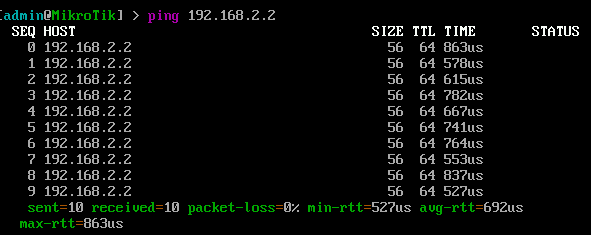

ping remote lan from MikroTik2:

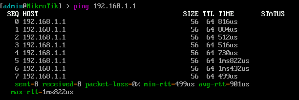

## Screenshots

Interface List (MikroTik1):

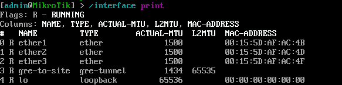

Interface List (MikroTik2):

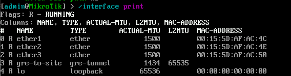

IP Address MikroTik1:

IP Address MikroTik2:

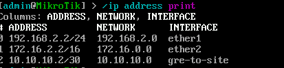

Static Route(MikroTik1):

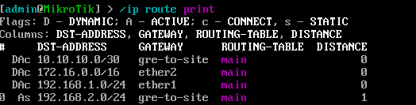

Static Route(MikroTik2):

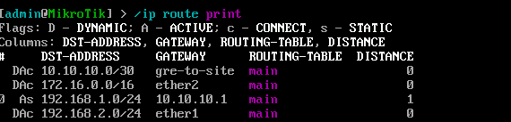

Interface GRE Tunnel(MikroTik1):

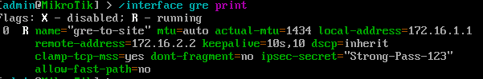

Interface GRE Tunnel(MikroTik2):

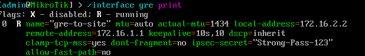

## Technologies Used
 - MikroTik RouterOS
   
 - GRE Tunnel
   
 - IPsec
   
 - Static Routing
   
 - Hyper-V
  

  
